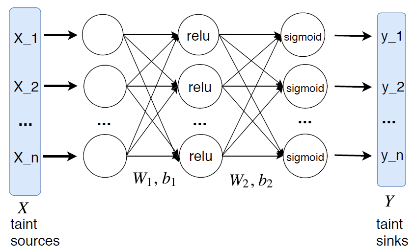

# 论文简报

## 论文信息

**题目**：Neutaint: Efficient Dynamic Taint Analysis with Neural
Networks(Neutaint：基于神经网络的高效动态污点分析)

**作者**：

Dongdong She：哥伦比亚大学博士，研究方向为系统安全和机器学习

Suman Jana：哥伦比亚大学助理教授，研究方向为计算机安全和机器学习

Baishakhi Ray：哥伦比亚大学助理教授，研究方向为可靠性和AI安全，ARISE
Lab成员，ARISE
Lab实验室主要关注于传统和基于AI进行研究，设计新的程序分析技术来分析程序行为。

**发表期刊（会议）**：

IEEE S&P

**发表时间：**

2020

## 论文简报

用自己的理解，阐述这篇论文针对什么问题，提出什么方法，解决效果如何。为方便阐述，可插入论文中的图，配合解释。尽量控制在500-800字的篇幅。

现有的DTA技术使用基于规则的污点传播，其既不准确(即高误报率)也不有效(即较大的运行时开销)。在正确覆盖所有极端情况的同时，很难为每个操作指定污点规则。论文提出了一种使用神经程序嵌入来跟踪信息流的新颖的端到端方法，NEUTAINT。神经程序嵌入可对目标程序在污染源和汇聚点之间进行的计算进行建模，通过观察各种执行轨迹来自动学习信息流。为了执行轻量级和精确的信息流分析，利用特征图来推断不同汇聚点的最具影响力的污染源。NEUTAINT构造两个特征图，一个流行的影响分析的机器学习方法，总结神经程序嵌入中的粗粒度和细粒度信息流。实验结果显示相比于最先进的动态污点分析工具，其精度有很大提高，性能开销也相对减少，可以检测现实程序中的漏洞。

### 1、Why

所有现有的DTA技术都基于每个已执行语句的规则集，在目标程序执行期间将污点标签从污点源传播到汇聚点sink。最终的污点结果是通过将各个语句的污点规则传播并组合在一起而得出的。本质上，最终输出指示污点source是否影响sink。但是这种基于规则的传播方法具有三个局限性：(i)指定准确的传播规则：即使对于看似简单的操作，由于可能要考虑许多不同的情况，因此准确地指定传播规则通常很困难。
(ii)累积误差：即使每个操作的污点传播规则都是准确的，但它们在多个操作中的构成也会引入较大的错误。在跨多个操作传播污点信息期间，可能会累积过污染和欠污染错误。
(iii)大的运行时开销：基于规则的传播会引入让人望而却步的运行时开销，因为必须检查每个操作以确定要应用的规则。

为了解决这些问题，TaintInduce提出从(输入，输出)指令对中学习特定于平台的污点传播规则。他们的方法基于模板学习传播规则，并使用一种算法来减少任务，以学习用于传播污点标签的不同输入集和前提条件。TaintInduce可以提高各个传播规则的准确性，但是由于基于传播的设计，它们仍然遭受累积的错误和较大的开销。

因此本文采用使用轻量级工具来构建神经程序嵌入，并直接分析由神经网络模型捕获的信息流。

### 2、What

整体流程如下，NEUTAINT使用轻量级的仪器从输入程序中收集各种各样的源和接收器。然后，我们训练神经程序嵌入，并使用基于梯度的分析来推断程序的信息流。

首先训练一个神经程序，以学习从污染源到sink的信息流。对于给定的程序和一组输入，标记这些输入，并使用轻量级工具收集sink变量的值。它们代表程序的动态行为。接下来训练神经网络模型(NN)来学习这种动态行为。神经网络模型近似一个将源映射到sink的函数。训练过程使学习此函数的错误最小化，从而提高了信息流跟踪的精度。

#### 1.  程序嵌入

NEUTAINT通过观察程序执行轨迹中的大量污染源－sink对来学习信息流。该模型在给定污染源作为模型输入的情况下预测污染sink变量的值。给定一组特定程序P的具体污点源x和相应的污点sink
y，神经程序用以下等式预测污点sink为y。

#### 2、影响分析

在训练了NN模型之后，构造两个特征图以分析神经程序中的信息流。从神经程序模型来看，当将所有sink都视为一个整体时，第一个特征图提供了粗粒度信息流的全局视图，第二个特征图可以为任何给定的sink提取最具影响力的污染源。

粗粒度信息流定义为每个源对所有sink的影响。为了提取粗粒度信息流，我们首先针对所有源计算污点sink的偏导数。令fi(θ，x)表示在执行带有污点源x的目标程序期间第i个污点sink变量的输出值。我们针对以下定义的给定污染源x计算导数，其中xj表示污染源中的第j个字节。

然后基于神经网络模型的偏导数，构造了一个特征图，以提供粗粒度信息流的全局视图。特征图S(x)定义如下。

细粒度的信息流定义为每个源对单个sink的影响。首先使用等式3计算Jacobian矩阵以获得梯度信息。在获得污染源中每个字节的梯度值之后，可以构造一个特征图，以推断从污染源到特定污染sink的细粒度信息流。由于只对污点sink对污点源中每个字节的敏感度感兴趣，因此采用梯度的绝对值来构造如下定义的特征图S(x)。

导致NN输出最大波动的字节被视为影响sink的污染源字节。可以通过找到最大值的top-k个字节来推断确定污点sink变量的源字节集，定义如下。

构造了两个特征图以推断从污染源到sink的信息流。特征图分析了NEUTAINT的输入特征的敏感性。特征越重要，对NN输出的影响就越大。首先定义一个特征图，以概括程序行为的粗粒度信息流，汇总所有输入和所有路径的梯度信息。然后，我们定义第二个特征图，以利用NN输出相对于输入的一阶偏导数来识别特定sink的最重要的污染源。

### 3、How

使用前6个程序来评估热字节准确性和污点引导的模糊测试实验，将多个污点sink设置为分支变量(即，条件谓词中使用的变量)。后面的5个程序在漏洞利用分析实验中进行了评估，因此它们在指定变量处只有一个污点sink。所有11个程序都将程序输入的每个字节设置为污点源。因此，污染源的总数就是输入字节的总数。

在精度方面，NEUTAINT比第二好的动态污点工具Libdft提高了10％的精度。至于每个程序的热字节精度，NEUTAINT在程序readelf，harfbuzz，mupdf，libxml，zlib上分别实现了7％，0％，7％，23％，40％的改进。NEUTAINT的准确性更高的原因在于，NEUTAINT是通过学习动态程序逻辑的基于程序语义进行的分析，而不是传统的动态污点分析工具的基于指令语义进行的分析。NEUTAINT可以灵活地适应各种执行环境，而动态污点分析工具无法通过固定的，预定义的污点传播规则准确地对其建模。

与先前最快的动态污点分析工具Libdft相比，NEUTAINT的运行时开销在GPU上要快40倍，在CPU上要快10倍。

对于每个漏洞，在导致漏洞的变量(例如，读/写功能使用的长度变量，分母使用的变量)处设置污点sink，还将程序输入设置为每个漏洞的污染源。NEUTAINT可以成功找到已知CVE中从源到sink的信息流。

### 4、Summary

论文采用神经程序嵌入应用于污点分析方面，而上次读书交流的NEUZZ采用神经程序梯度平滑应用于模糊测试，这两者使用的技术非常类似，作者也是同一作者，因此我们可以把自己所学的知识应用于漏洞分析的各个方面，像污点分析、符号执行、模糊测试等等。而对于其中的信息提取，是否可以应用语义感知神经网络进行提取，效果是否会更好，可以进行一下实验测试。
